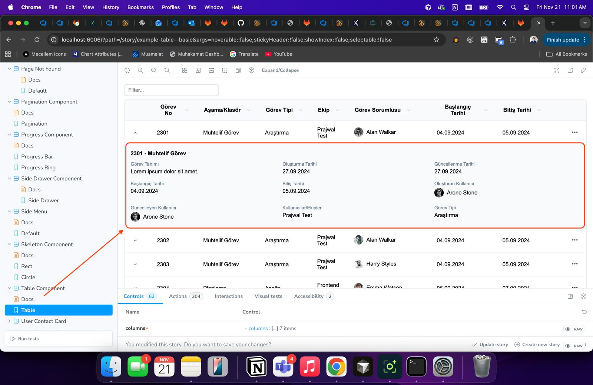
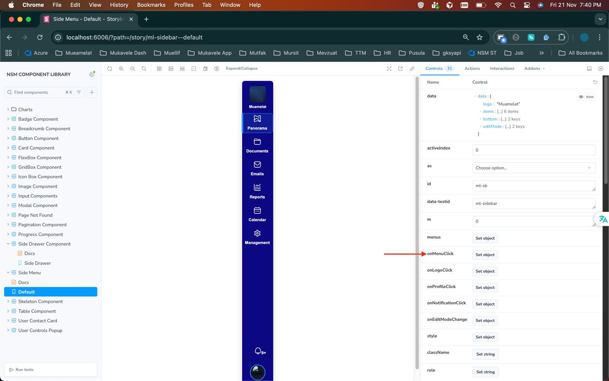
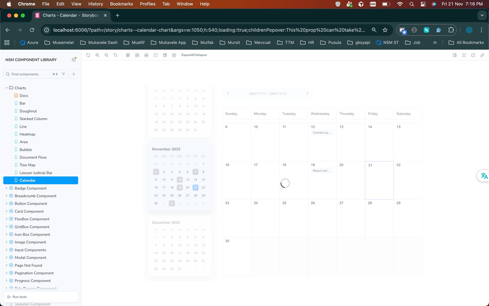

# React Component Library

A reusable, scalable **React component library** built to ensure UI consistency, faster development, and improved collaboration across teams.  
The library is documented and showcased using **Storybook**.

---

## ✨ Features

- Reusable and composable React components
- Built with modern React (Functional Components & Hooks)
- Interactive component documentation with Storybook
- Fully isolated component development
- Theming and customization support
- Accessible and responsive UI components
- Optimized for performance and scalability

---

## Screensnaps







---

## 🧰 Tech Stack

- **React**
- **Storybook**
- **JavaScript / TypeScript**
- **CSS / SCSS / Styled Components** (based on setup)
- **Webpack / Vite**
- **ESLint & Prettier**

---

## 📦 Installation

Install the package using npm or yarn:

```bash
npm install @your-org/component-library
# or
yarn add @your-org/component-library
````

---

## 🚀 Usage

Import and use components directly in your React application:

```jsx
import { Button, Input } from '@your-org/component-library';

function App() {
  return (
    <div>
      <Button variant="primary">Click Me</Button>
      <Input placeholder="Enter text" />
    </div>
  );
}

export default App;
```

---

## 📘 Storybook

Storybook is used to develop, test, and document components in isolation.

### Run Storybook locally

```bash
npm run storybook
# or
yarn storybook
```

Open your browser at:

```
http://localhost:6006
```

Each component includes:

* Variants
* Props controls
* Usage examples
* Accessibility checks (if enabled)

---

## 🧩 Components

Some of the available components include:

* Button
* Input
* TextArea
* Modal
* Tooltip
* Dropdown
* Card
* Loader
* Toast / Notification

> Refer to Storybook for the complete list and live examples.

---

## 🎨 Theming & Customization

The library supports theming via:

* CSS variables / theme provider
* Variant-based props
* Custom styles override

Example:

```jsx
<Button variant="secondary" size="large" />
```

---

## 🧪 Testing

Components can be tested using:

```bash
npm run test
# or
yarn test
```

Supported testing tools:

* Jest
* React Testing Library
* Storybook interaction tests (optional)

---

## 🛠 Development

### Install dependencies

```bash
npm install
```

### Start development mode

```bash
npm run dev
```

### Build library

```bash
npm run build
```

---

## 📁 Folder Structure

```txt
src/
 ├── components/
 │    ├── Button/
 │    │    ├── Button.jsx
 │    │    ├── Button.stories.jsx
 │    │    ├── Button.styles.js
 │    │    └── index.js
 │    └── ...
 ├── themes/
 ├── utils/
 └── index.js
```

---

## ♿ Accessibility

* Semantic HTML
* Keyboard navigation support
* ARIA attributes where required
* Color contrast awareness

---

## 🤝 Contributing

1. Fork the repository
2. Create a feature branch
3. Commit changes with clear messages
4. Open a pull request

Please ensure:

* Components are documented in Storybook
* Tests are added/updated
* Linting passes successfully

---

## 📄 License

This project is licensed under the **MIT License**.

---

## 📬 Support

For issues, feature requests, or questions:

* Open an issue in the repository
* Contact the maintainers

---

### Happy Building 🚀

```


